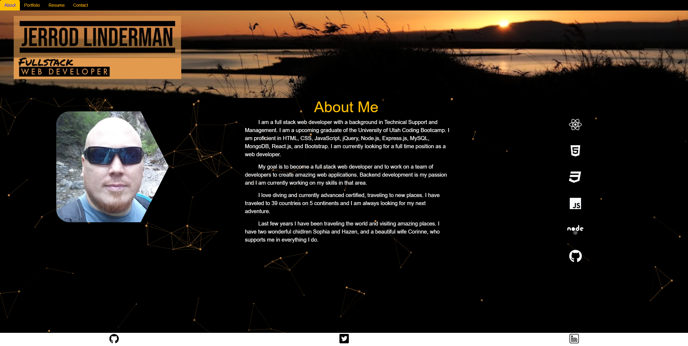

  

  
  

  

  
  ## Jerrod Linderman

  

  

  
  

  
  
  <h1 align="center">Badges</h1>
  

  

  
  

  
  
  
  

  

  
  <h1 align="center">
  
  React Profile Jerrod Linderman</h1>

  
  
  
  ## Table of Contents:
  1. [Description](#description)
  2. [Installation](#installation)
  3. [Usage](#usage)
  4. [license](#license)
  5. [Github](#github)
  6. [Email](#questions)

  ## Description
  Deployed React portfolio with About me, Portfolio list of applications, resume and a contact me

  ## Installation
  ''npm install'' then ''npm start''

  ## Contribute
  

  [Contributor Covenant](https://www.contributor-covenant.org/)

  At this time owner is not accepting any contributions to this project.

  ## License

  Published under the [MIT](license.txt) License.
  

  Read More about the licence by clicking this Link: [MIT](https://opensource.org/licenses/MIT).
 

  ## GitHub
  [nvmax](https://github.com/nvmax)

  ## Questions
  If you have any questions, please contact me by clicking the email link below:
  ### [nvmaxx@gmail.com](nvmaxx@gmail.com) 

 
